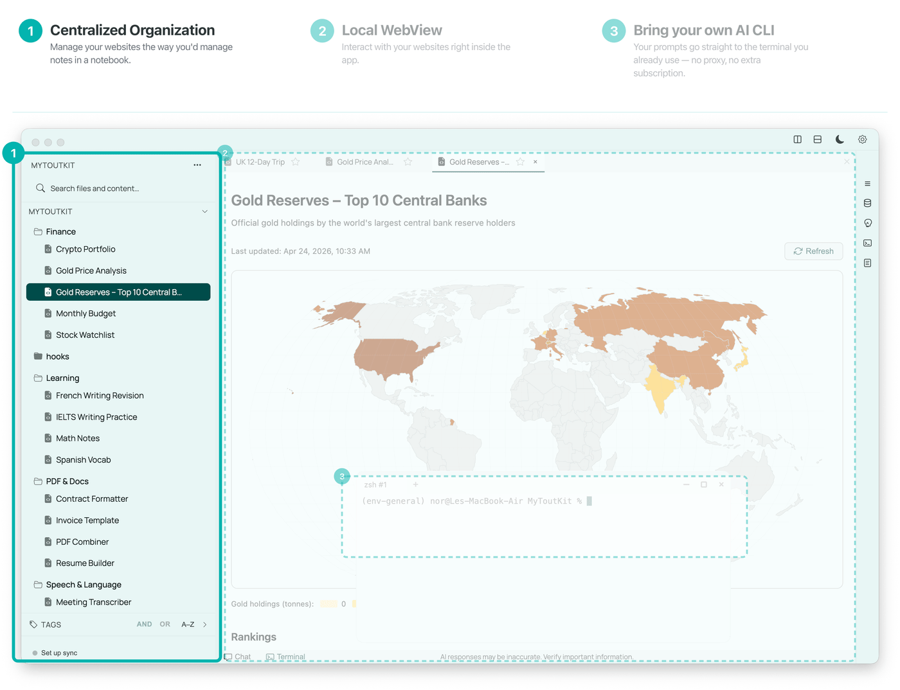

<p align="center">
  
  <picture>
    <source media="(prefers-color-scheme: dark)" srcset="assets/logo-fullname-dark.png">
    
  </picture>
</p>

<h1 align="center">A notebook for vibe-coded websites</h1>

<p align="center">
  Anything you're curious about becomes your own interactive page.
</p>

<p align="center">
  <a href="https://youtu.be/ZjUs5zavs3E"></a>
  <a href="https://discord.gg/XErCw8DxX2"></a>
</p>

**Two everyday frustrations of vibe-coding, solved:**

- **Lost folders. Forgotten commands.** → Every project **lives in your notebook, runs in one click** — frontend and backend.
- **Walls of text from AI.** → Answers come back as **interactive pages**.

<p align="center">
  
</p>

ToutKit is a desktop app that pairs a sidebar of notes with a built-in terminal for AI CLIs (Claude, Codex, Gemini) and an in-app browser that renders whatever the AI writes.
Each note is a self-contained folder with its own SQLite database, key/value store, attached files, and scripts — so a note can grow from a static page into a sortable table, an interactive dashboard, or a research tool, without leaving your filesystem.
Everything stays on your disk; nothing syncs to a ToutKit-run server unless you opt in.

<p align="center">
  <a href="https://github.com/toutkit/toutkit/releases/latest"><strong>Download</strong></a> ·
  <a href="#install">Install from source</a> ·
  <a href="#see-it-work">See it work</a> ·
  <a href="https://youtu.be/ZjUs5zavs3E">Watch the demo</a>
</p>

---

## Why I built this

> "For answers, I often have it generate dynamic htmls (with js) that allows me to sort/filter data and to tinker with visualizations interactively." — [Lex Fridman](https://x.com/lexfridman/status/2039841897066414291), replying to Andrej Karpathy's "LLM Knowledge Bases" post on X, April 2026.

I'm Stephen Z, founder of ToutKit and a vibe-coder. I've built many small projects since 2024: some are tools that help me handle PDFs, text, audio, and video; some are products for users; and some are actually a note-taking process in VS Code with Agent as the writer. Before that, I was a business analyst at an internet company.

**An idea from someone who likes to take notes.**
I like taking notes — for big or small decisions, or any kind of planning. I also like Obsidian very much. But I have been thinking about a more native way to write in this Agent era. Is it still a cursor and text running from left to right, top to bottom?

**AI handles writing today, but it still lacks a "Canvas" — and you need a GUI.**
Today, AI already handles the writing instead of the human. However, for the frontend, it's still the same window and the same layout, which I thought might need an upgrade. Considering AI's proficiency at writing not only markdown but also code, why don't we ask AI to take notes directly in the format of a website, or even an application? That's what ToutKit would like to do: give you a GUI and, at the same time, give AI a "Canvas" instead of fixed lines. With that GUI/"Canvas", you can interact with AI more freely, and AI can give you feedback in a much richer and more dynamic way. Whether you're asking AI to do research in some field, or to make a plan for something, you'll get a website or application back, instead of lines of text to scan over and over.

[Learn more about this idea on YouTube](https://youtu.be/ZjUs5zavs3E).

## What is ToutKit

**"Chrome + VS Code"**
- **A terminal inside**: Just use Claude Code/Codex/Gemini CLI directly, like what you do in VS Code
- **A note management sidebar**: Just like any note application, arrange notes in hierarchy. The difference is that each note is actually a project folder behind on your system (while we don't need to think about that since that's handled by AI only).
- **The GUI - "Browser"**: ToutKit has a "browser" in the app. So with one-click, any website can be displayed directly in it.
- **Also, a "backend"**: website in the app can have attached scripts to run. So your notes are no longer static, but can be dynamic, and merged into your workflow.
- **A special local storage structure**: Every note is a self-contained folder with its own SQLite database, key/value store, attachments, and scripts. Move the folder and the whole note — data, code, and all — moves with it.

**Who this is for:**
- If you like to write notes, and you want something more than text
- If you vibe code tools for yourself, and you want a place to collect them


## Install

The easiest way is to grab a pre-built release. Building from source is for people who want to hack on it.

### Download the app

[**Download the latest release →**](https://github.com/toutkit/toutkit/releases/latest)

### Run from source

If you'd rather clone and run, you'll need [Node.js](https://nodejs.org/) v18+ and npm:

```bash
git clone https://github.com/toutkit/toutkit.git
cd toutkit
npm ci
cp auth-config.example.json auth-config.json
npm start
```

`auth-config.json` holds endpoints for the optional cloud features (login, sync). The checked-in `auth-config.example.json` contains placeholder values — the app boots fine with them, but those features won't connect to anything until the values are filled in. Local-only features (workspace, notes, AI CLIs, terminal) work out of the box. Sharing uses your own GitHub account and doesn't need anything in `auth-config.json`.


## See it work

A quick walk-through of the everyday loop:

1. **Open a workspace** — pick an existing project folder, or create a new one from the sidebar. Your notes live as folders inside it.
2. **Open the terminal** — pop open the built-in terminal at the bottom of the window.
3. **Launch an AI CLI** — start `claude`, `codex`, or `gemini` right there, the same way you would in VS Code or any other IDE.
4. **Ask it to build something** — just tell it what you want: *"Make me a little page that introduces my favorite coffee shops, with photos and a map."* The agent writes the `index.html` (and any scripts or data it needs) straight into the note folder.
5. **See it render** — the viewer picks up the file and shows the page live. Edit the prompt, iterate, and the page updates in place — a GUI grown by conversation, sitting next to your notes on disk.


## How "backend" works?

In a normal web app, your frontend calls an API, the API runs some code on a server, that code reads or writes a database, and the frontend reads the updated data back. ToutKit does the same thing — except the "server" is a script sitting next to your note, and the "database" is the `storage/` folder right next to it.

**The flow.** The page calls `window.noteScripts.run('fetch_data.py', [...])`. The script starts as a real subprocess (Python / Bash / Node / Ruby), with its working directory set to the note's `scripts/` folder and two environment variables injected: `NOTE_ID` (which note this is) and `WORKSPACE_PATH` (where the workspace lives on disk). From those two it can find everything else. stdout/stderr streams back to the page in real time and is also appended to `scripts/logs/{name}.log`. When the script exits, the page reads the updated storage via `noteDB` / `noteSQL` / `noteFiles` and re-renders. That's the full loop — the same shape as a click handler calling an endpoint that mutates a DB, except the "endpoint" is `scripts/fetch_data.py`, the "DB" is `storage/db.sqlite`, and nothing ever leaves your machine.

**Scripts share the same storage as the page.** This is the important part: the script can write straight into the note's own storage folder, and the page will read exactly the same bytes back:

- `../storage/kv.json` — any language can open a JSON file. Append a field, the page picks it up on next `noteDB.get()`.
- `../storage/db.sqlite` — any language with a SQLite binding (Python's `sqlite3`, Node's `better-sqlite3`, Ruby's `sqlite3`, the `sqlite3` CLI in Bash) can open this file and `INSERT`/`UPDATE`/`SELECT` against it. The DB runs in WAL mode so the page and the script can hold handles at the same time without blocking each other.
- `../storage/files/` — drop a downloaded PDF, a generated chart, a cached dataset here. `noteFiles.load()` on the page reads it back.

So a Python script can `pip install requests`, hit an API, parse the JSON, and `INSERT` rows into `db.sqlite`; the page then queries those rows and renders a table. That's the classic "frontend → API → database → frontend" pattern, fully local, zero deployment.

**Safety rails.** Scripts are **off by default** — every script has to be explicitly approved from the UI before it can run, and approvals are stored per-note in `.notes-app/script-whitelist.json`. A note can only execute files inside its own `scripts/` folder (path traversal attempts are rejected at the IPC layer), and it can only pass string arguments, capped in count and size. If you want to stop a long-running script, `noteScripts.stopByName('fetch_data.py')` from the page kills it.

**Per-note Python environments.** Drop a `.venv/` inside a note's `scripts/` folder (or at the note root) and ToutKit auto-detects it — Python scripts for that note run through that interpreter, with `PATH` and `VIRTUAL_ENV` set correctly. Each note can pin its own dependencies without leaking them into your system Python.

**Why this matters.** Because the script and the page share `storage/`, you can build a real tiny app inside a single note: an HTML dashboard backed by scripts that fetch, transform, and save data into SQLite. No server to deploy, no auth to wire up, no API to version. The "cloud" is just a subdirectory, and the "backend" is whatever language you like.


## How "notes" are stored

Each note in your workspace is a **folder**, not a single file. The folder is the note, and everything the note needs lives next to it on disk:

```
my-workspace/
├── research-on-kafka/          ← one note
│   ├── index.html              ← what you see in the viewer
│   ├── storage/
│   │   ├── kv.json             ← noteDB: simple key/value store the page can read/write
│   │   ├── db.sqlite           ← noteSQL: per-note SQLite database (WAL mode)
│   │   └── files/              ← noteFiles: binary/blob store (images, CSVs, PDFs, audio…)
│   └── scripts/
│       ├── fetch_data.py       ← scripts the note is allowed to run
│       ├── build_chart.sh
│       └── logs/               ← stdout/stderr captured per run
├── meeting-2026-04-15/
│   └── index.html
├── _templates/                 ← folder-based templates (copied verbatim on "New from Template")
└── .notes-app/                 ← workspace-level app state (local, safe to delete)
    ├── favorites.json
    ├── script-whitelist.json
    └── search.db               ← Lunr + SQLite metadata index
```

**Why folders instead of flat files.** Once a note is just `index.html`, it can only be text. Once it's a folder, it can be a tiny website with its own data, code, and assets. The note becomes self-contained — you can zip the folder, hand it to someone else, and everything still works.

**Per-note storage — three kinds, one folder.** The viewer exposes three storage APIs to the page's JavaScript, picked to match the shape of the data:

- **`noteDB`** — a JSON key/value store backed by `storage/kv.json`. Best for small, structured state: form values, user preferences, toggles, cached settings. Form inputs on the page are actually auto-persisted here, so typing into a field and reloading just works.
- **`noteSQL`** — a real SQLite database at `storage/db.sqlite`, powered by `better-sqlite3` in WAL mode. The page issues `exec`/`query` calls over IPC; the main process is the only thing that ever touches the file. Use this when the note needs tables, joins, or more than a few KB of data — logs, datasets, time series, anything you'd reach for a database for.
- **`noteFiles`** — a binary/blob store at `storage/files/`. `save`, `load`, `delete`, `list`, `import` from disk. This is where big things go: images, CSVs, PDFs, audio, downloaded datasets — anything too bulky for JSON or SQL cells.

Together these cover the full range: tiny state in `noteDB`, structured/queryable data in `noteSQL`, and large opaque blobs in `noteFiles`. A note about running experiments can insert rows into SQLite as you run them. A reading list can store entries in SQL and re-render the table on every open. A data-exploration note can `import` a 200 MB CSV into `storage/files/` once, then read it back without re-uploading. Because all three live inside the note folder, moving the folder moves the note *and* all of its data — nothing is stranded in an app-wide database somewhere else on your disk.

**Attached scripts.** Anything you drop into a note's `scripts/` folder can be executed from the note itself — Python (`.py`), Bash (`.sh`), Node (`.js`), or Ruby (`.rb`). Scripts are **off by default**: you explicitly approve each one from the UI before it can run, and approvals are stored per-note in `.notes-app/script-whitelist.json`. Output is streamed back to the page and also tee'd to `scripts/logs/{name}.log` (auto-rotated) so you can inspect what a script did after the fact. Combined with `kv`/`sql`, this means a note can fetch data on demand, write it into its own database, and re-render — a small, self-contained workflow, not a static document.

**Workspace-level state.** The `.notes-app/` folder at the workspace root holds things that don't belong to any single note: favorites, the script whitelist, the Lunr full-text index, and cached SQLite metadata. It's regenerable — deleting it loses UI state like starred notes but never loses note content. It's also automatically added to `.gitignore` so you don't accidentally commit it.

**What this means in practice.** Your workspace stays fully inspectable with plain tools (`ls`, `grep`, `git`), your notes are portable (copy the folder, you have the note and its data), and each note can grow from a static page into a tiny interactive app without leaving the filesystem.


## Features

**Terminal — where you talk to AI.** ToutKit has a built-in terminal that sits right underneath the main window. It's where you chat with Claude, Codex, or Gemini and ask them to do things: write a note, pull some data, summarize a PDF, build a little tool. If you've seen a black window with text in it before, this is the same thing — and if you haven't, don't worry: once you start one of the AI tools, you just type what you want in plain English.

You can open several terminal tabs at once, so one can be Claude writing a note while another is Codex working on something else. Each tab shows a small glowing dot when the AI is thinking, so you always know which one is waiting for you. You can also drag the terminal out into its own window if you'd like more room.

**Note Management — your notes, organized.** The sidebar on the left shows all your notes in a folder tree, just like Finder on a Mac or File Explorer on Windows. You can create folders, drag notes around, rename them, delete them, and search across every note's title and content from the box at the top. A "Favorites" section keeps the notes you use most at the top, and a "Tags" section lets you group notes by topic (e.g. #travel, #recipes) and filter the tree down to just those.

Every note is a real folder on your computer — nothing is locked inside the app. That means you can also move notes around in Finder, back them up to iCloud or Dropbox, or zip a note up and email it to a friend. The app picks up whatever you do on disk automatically.

**Backend Scripts — give your notes superpowers.** A normal note is just a page you read. In ToutKit, a note can also *do things*: fetch the latest weather, pull your bank transactions, summarize a PDF you just dropped in, regenerate a chart from fresh data. It does this by running little helper scripts that live next to the note — written by the AI for you, in Python or a similar language. You don't need to know how they work; you just click a button on the note and something happens.

Safety first: no script ever runs without your permission. The first time a note wants to run something, ToutKit asks you to approve it, and you can revoke that approval any time. Approvals are remembered per note, so you only get asked once per script.

**Local databases — notes that remember things.** Regular notes forget everything between visits. ToutKit notes can store structured information right inside themselves: a running list of books you've read with ratings, a log of workouts, a table of contacts, a price history of something you're tracking. The data lives in a small private database attached to the note, so the note can show you a sortable, filterable table instead of a static list.

All of this is stored inside the note's own folder. If you move or copy the note, the data moves with it. There's no separate "library" file to worry about and nothing syncs to a company server you don't control.

**Website memory storage — fill in forms without losing them.** If a note has a form — a text box, a checklist, a dropdown, a draft area — whatever you type is remembered automatically. Close the note, come back a week later, and everything you'd filled in is still there. This is what makes a ToutKit note feel like a real tool instead of a static page: a weekly review template keeps last week's answers, a packing list remembers what you checked off, a journal keeps your draft safe even if the app crashes.

You don't configure anything for this to work — it just happens. If you ever want to start fresh, there's a reset option in the note's menu.

**Sharing — publish a note from your own GitHub (optional).** When you want to send a note to someone else, ToutKit publishes it through *your* GitHub account, not a ToutKit server. The first time you share, you connect GitHub once (device-code login, no password typed into the app) and pick a name for a small repo on your account — `toutkit-shares` by default. ToutKit creates that repo, drops in a tiny renderer page, and turns on GitHub Pages for it. After that, each time you share a note, the note's HTML is saved as a **gist** on your account (public or secret, your choice) and the share link points at your Pages site, which loads the gist and shows the note. Nothing about the note ever touches a ToutKit-run server — the gist lives in your GitHub, the renderer lives in your repo, and the link is `https://<your-username>.github.io/<your-repo>/?id=…`. Disconnecting GitHub later doesn't break the links you've already shared.

**Sync — your notes, everywhere (optional).** If you'd like your notes on more than one computer, you can turn on sync and ToutKit will keep everything mirrored in the background: text, form data, attached files, the whole thing. It works the way you'd expect — edit something on your laptop, open your desktop, and the change is already there. If you go offline, it waits patiently and catches up when you're back online. If two devices edit the same note at once, ToutKit tells you instead of silently picking a winner.

Sync is **off by default and completely optional**. If you never turn it on, your notes never leave your computer — no account, no cloud, no tracking.


## License

ToutKit is licensed under the **GNU Affero General Public License version 3.0 (AGPL-3.0-only)**. See [`LICENSE`](LICENSE) for the full text.

The "ToutKit" name and the "Helicase.space" brand (including typographic variants such as "Helicase Space" and "Helicase"), together with the icon files under `assets/` (`icon.icns`, `icon.png`), are **reserved marks and assets of Helicase Space LLC** and are **not** licensed under the AGPL. See [`NOTICE`](NOTICE) for details. If you fork or redistribute a build of this app, please use your own product name and icon rather than ToutKit's branding.

Third-party dependencies and their licenses are listed in [`THIRD_PARTY_LICENSES.md`](THIRD_PARTY_LICENSES.md).

Contributions are welcomed under the terms of the [Contributor License Agreement](CLA.md).

---

Thank you.
